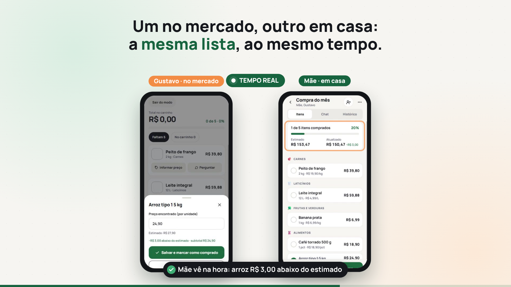
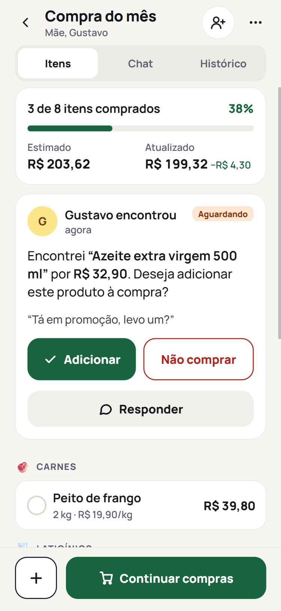
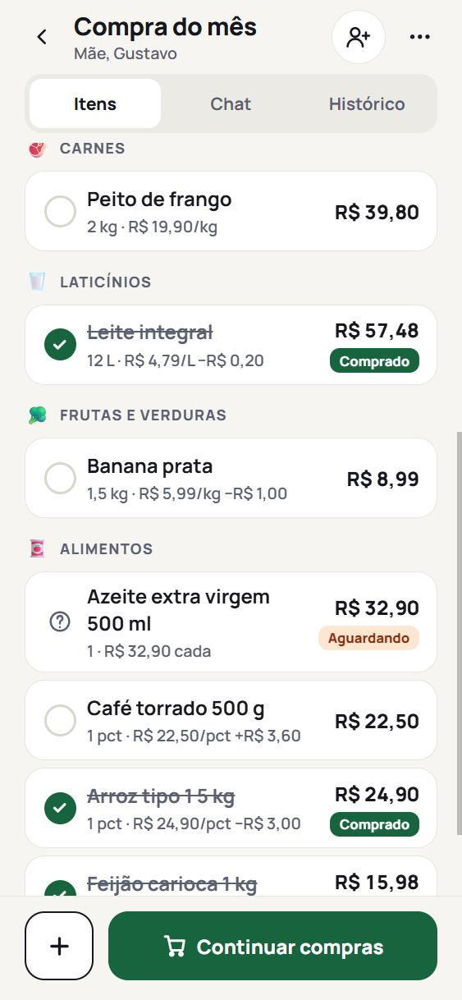
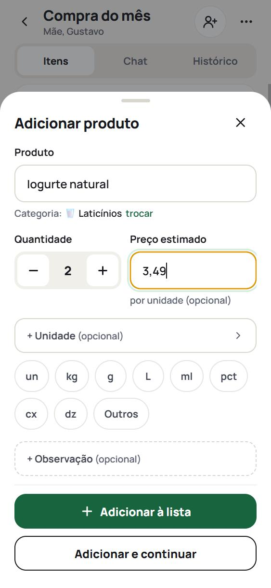
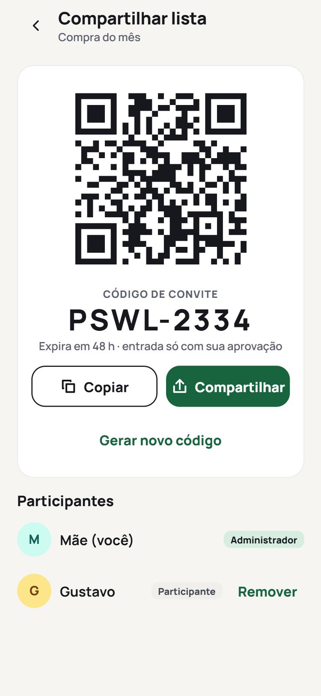

# Junto — lista de compras colaborativa

**Faça as compras junto com quem divide a casa, em tempo real.**

[](https://github.com/Guhssantos/junto/actions/workflows/ci.yml)
[](LICENSE)
[](https://junto.gusttavo-ssantos.workers.dev)

👉 **Use agora, de graça:** <https://junto.gusttavo-ssantos.workers.dev> (celular ou computador; dá para instalar na tela inicial)

### 🎬 O Junto em 40 segundos

[](docs/video/junto-40s.mp4)

<sub>Telas reais do app: duas pessoas usando a mesma lista ao mesmo tempo. Com trilha sonora original; ative o som. Também há a [versão completa de 1min38s](docs/video/junto-apresentacao.mp4). Como os vídeos são gerados: [video/README.md](video/README.md).</sub>

> **De uma necessidade do dia a dia a uma solução tecnológica.** O Junto nasceu de uma situação real (fazer compras com a minha mãe comparando preços entre mercados) e virou um app completo: React Native + Expo, Supabase com tempo real, regras de segurança no banco, modo offline, testes automatizados e CI/CD. Veja a [história](#a-história), [o que ele faz](#o-que-ele-faz) e [como foi feito](#como-foi-feito).

## A história

A ideia surgiu numa ida ao supermercado com a minha mãe. Para descobrir onde cada produto valia mais a pena, a gente acabava pesquisando preços e indo a dois ou mais mercados. E a lista, os preços e as decisões ("levo esse ou compro no outro?") ficavam espalhados entre papel, memória e mensagens soltas.

O **Junto** coloca tudo isso num só lugar: duas (ou mais) pessoas compartilham a mesma lista. Enquanto uma está no mercado anotando o preço que encontrou, a outra acompanha **na hora**, de onde estiver, e ajuda a decidir o que comprar.

| Decisão em tempo real | Preço encontrado × estimado | Conversa na lista |
| :---: | :---: | :---: |
|  |  |  |
| **Adicionar produto** | **Convite por QR Code** | |
|  |  | |

## O que ele faz

- 🛒 **Lista compartilhada em tempo real**: quem está em casa vê cada item marcado e cada preço no mesmo instante.
- 💰 **Preço estimado × encontrado**: mostra quanto cada item ficou acima ou abaixo do esperado e o total atualizado da compra.
- 🙋 **"Perguntar ao parceiro"**: achou algo fora da lista ou em promoção? Pergunta antes de colocar no carrinho; a outra pessoa aprova ou recusa.
- 💬 **Chat por lista e por produto**, com **fotos** (câmera ou galeria): "é essa marca?"
- 📲 **Convite por link, código ou QR Code**, com aprovação de quem criou a lista.
- 🧺 **Modo mercado**: tela simplificada para usar com uma mão no corredor.
- 📴 **Funciona sem internet**: a lista abre e as alterações são enviadas quando o sinal volta.
- 🔔 **Alertas** (deslize para excluir) e notificações push no app nativo.
- 📱 **Celular, tablet e computador**: web/PWA instalável, Android e iOS com o mesmo código.
- 🔒 **Privacidade**: cada pessoa só vê as listas de que participa (regras no próprio banco — RLS), fotos em armazenamento privado e exclusão de conta (LGPD).

## Contribua

Ideias e contribuições são muito bem-vindas! Veja o [guia de contribuição](CONTRIBUTING.md) para rodar o projeto na sua máquina em poucos minutos, ou [abra uma issue](https://github.com/Guhssantos/junto/issues/new/choose) com um problema ou sugestão.

Próximas ideias: histórico de preços por mercado ("onde está mais barato"), itens recorrentes e sugestões automáticas — veja as [issues](https://github.com/Guhssantos/junto/issues).

---

## Como foi feito

| Camada | Tecnologia |
| --- | --- |
| App | React Native + Expo SDK 57, TypeScript, Expo Router (Android, iOS e web/PWA) |
| Backend | Supabase (PostgreSQL 17, Auth, Realtime, Storage, Edge Functions) |
| Regras de negócio | Funções SQL (RPC) + Row Level Security |
| Push | Expo Push Service via Edge Function `send-push` |
| Estado e offline | TanStack Query (cache persistido) + fila de alterações própria |
| Testes | Jest + Testing Library (app) e testes SQL em PostgreSQL (PGlite embutido, sem instalar nada) |
| Hospedagem web | Cloudflare Workers (publicado) · Netlify / Vercel (configurações incluídas) |
| Automação | GitHub Actions: CI, deploy do banco e keep-alive do Supabase |

> Por que essas escolhas: veja [docs/ARQUITETURA.md](docs/ARQUITETURA.md).

---

## 1. Requisitos

- Node.js 20+ e npm
- Conta gratuita no [Supabase](https://supabase.com) (ou Docker para rodar o Supabase local)
- Para usar: qualquer navegador moderno. Opcional: app **Expo Go** no celular (teste nativo) ou um *development build* (push no Android)
- Opcional: conta gratuita na [Expo](https://expo.dev) para gerar APK e push nativo

## 2. Instalação

```bash
npm install
npm run setup             # pergunta a URL e a chave do Supabase e cria o .env
```
(Ou copie `.env.example` para `.env` e preencha à mão — seção 4.)

## 3. Banco de dados

### Opção A — projeto Supabase na nuvem (recomendado para testar com outra pessoa)

1. Crie um projeto em <https://supabase.com/dashboard> (região **South America (São Paulo)**).
2. Aplique as migrações:
   ```bash
   npx supabase login
   npx supabase link --project-ref SEU_PROJECT_REF
   npx supabase db push
   ```
   (Alternativa sem CLI: cole os arquivos de `supabase/migrations/` em ordem no **SQL Editor** do painel.)
3. Configure autenticação, e-mail de recuperação e push conforme [docs/CONFIGURACAO.md](docs/CONFIGURACAO.md).

### Opção B — Supabase local (Docker)

```bash
npx supabase start        # sobe Postgres, Auth, Realtime, Storage e o painel em http://localhost:54323
npx supabase db reset     # aplica as migrações
```
A URL e a `anon key` locais aparecem no terminal. E-mails (recuperação de senha) ficam em <http://localhost:54324>.

## 4. Variáveis de ambiente (`.env`)

| Variável | Obrigatória | Descrição |
| --- | --- | --- |
| `EXPO_PUBLIC_SUPABASE_URL` | sim | URL do projeto (Project Settings → API) |
| `EXPO_PUBLIC_SUPABASE_KEY` | sim | `anon` / `publishable` key. **Nunca** use a `service_role` no app |
| `EXPO_PUBLIC_EAS_PROJECT_ID` | para push | gerado por `npx eas-cli init` |
| `EXPO_PUBLIC_INVITE_BASE_URL` | não | endereço do site publicado (ex.: `https://junto.pages.dev`) para os links de convite gerados no app nativo. Na versão web o próprio endereço do site é usado automaticamente |

Segredos do servidor (`PUSH_WEBHOOK_SECRET`, `EXPO_ACCESS_TOKEN`) ficam no Supabase, não no `.env` do app.

## 5. Executar localmente

```bash
npm run web               # navegador: http://localhost:8081
npm start                 # celular: QR Code para o Expo Go
```
No celular, escaneie o QR Code com o Expo Go (Android) ou a Câmera (iOS). Para testar a colaboração, entre com **duas contas em dois aparelhos** (ou um aparelho + emulador), crie uma lista numa conta e use **Compartilhar lista** para convidar a outra.

Push notifications no Android exigem *development build*:
```bash
npx eas-cli build --profile development --platform android
```

## 6. Testes

```bash
npm test          # 91 testes do app: cálculos, offline, conflitos, auth, convites, web, unidades, componentes
npm run test:db   # 23 cenários do banco: RLS, permissões, convites, conflitos, aprovação, fotos, LGPD, unidades, limpeza
npm run typecheck
npm run lint
npm run test:all  # tudo acima
npm run build:web # gera o site em dist/ (o mesmo que é publicado)
```
`test:db` roda num PostgreSQL embutido (PGlite) — funciona em Windows, macOS e Linux sem instalar PostgreSQL nem Docker. Para usar um PostgreSQL real: `npm run test:db:pg`. Detalhes em [docs/DESENVOLVIMENTO.md](docs/DESENVOLVIMENTO.md#testes).

## 7. Estrutura do projeto

```
src/
  app/                 Telas (Expo Router: cada arquivo é uma rota)
    (auth)/            entrar, criar conta, recuperar senha
    (app)/(tabs)/      Início, Compras, Alertas, Conversas, Perfil
    (app)/lists/[id]/  lista, modo mercado, compartilhar, resumo, produto
    (app)/join/        entrar por código, link ou QR Code
  components/ui/       Design system (Button, Card, Input, Sheet, Badge, Avatar…)
  components/…         componentes de listas, produtos e chat
  services/            Acesso ao Supabase (auth, listas, produtos, chat, convites, push)
  hooks/               Consultas (React Query), tempo real, rede
  offline/             Fila de alterações offline, sincronização e conflitos
  providers/           Autenticação e efeitos globais
  lib/                 Regras puras: dinheiro, totais, categorias, convites, erros
  theme/               Tokens do design system (claro/escuro)
  types/               Tipos do domínio
  config/              Variáveis de ambiente validadas
  ai/                  Ponto de extensão para recursos de IA (futuro)
supabase/
  migrations/          Esquema, segurança (RLS), regras de negócio (RPC), realtime/push/storage
  functions/send-push/ Edge Function de push
  tests/               Testes SQL
public/                Arquivos da versão web: index.html, manifest (PWA), service worker, ícones, _headers
scripts/               setup (cria o .env) e testes do banco
.github/workflows/     CI, deploy do banco e keep-alive do Supabase
docs/                  Arquitetura, banco, segurança, configuração, deploy, desenvolvimento, revisão
```

## 8. Documentação

- [Arquitetura e escolhas técnicas](docs/ARQUITETURA.md)
- [Banco de dados](docs/BANCO_DE_DADOS.md)
- [Segurança e privacidade (LGPD)](docs/SEGURANCA.md)
- [Configuração: autenticação, e-mail, push, armazenamento](docs/CONFIGURACAO.md)
- [**Colocar no ar de graça (web + celular)**](docs/DEPLOY_GRATUITO.md)
- [Deploy: APK, AAB, iOS e backend de produção](docs/DEPLOY.md)
- [Desenvolvimento: novas funcionalidades, configurações e testes](docs/DESENVOLVIMENTO.md)
- [Revisão final: problemas encontrados, correções e próximos passos](docs/REVISAO.md)
- [Divulgação: vídeos, post para o LinkedIn e configuração do GitHub](docs/DIVULGACAO.md)

## 9. Custos

Tudo roda **gratuitamente**:

- **Supabase Free**: 500 MB de banco, 1 GB de fotos, 50 mil usuários ativos/mês, 200 conexões em tempo real. A pausa por inatividade (~7 dias) é evitada pelo workflow `keepalive.yml`, e a limpeza diária automática mantém o banco pequeno.
- **Cloudflare Pages / Netlify**: hospedagem do site gratuita.
- **GitHub Actions**: CI, deploy e keep-alive dentro da cota gratuita.
- **Expo**: push gratuito; builds EAS com cota gratuita mensal (opcional — a versão web não precisa de build).
- Custos só existem se você **quiser** publicar nas lojas (Google Play US$ 25 uma vez; Apple US$ 99/ano) ou crescer além dos limites gratuitos (Supabase Pro, US$ 25/mês, traz backups diários).

Confira os limites atuais nos sites oficiais, pois mudam com frequência. Detalhes e mitigação de cada limite em [docs/DEPLOY_GRATUITO.md](docs/DEPLOY_GRATUITO.md#limites-do-plano-gratuito-e-o-que-o-projeto-já-faz-a-respeito).
